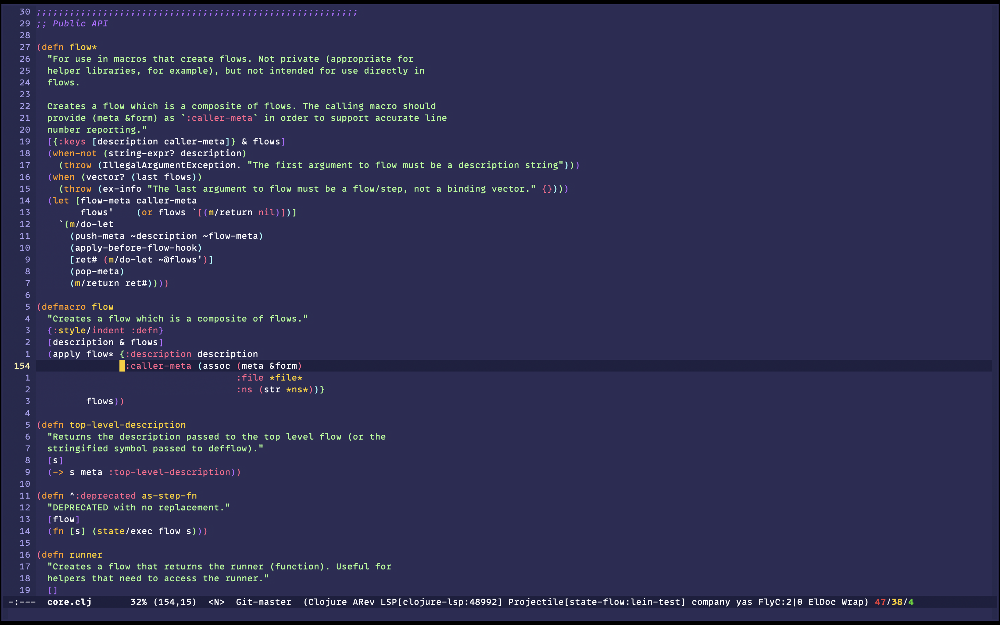

# Shades of Purple Theme for Emacs

Ported from the
[original](https://github.com/ahmadawais/shades-of-purple-vscode), by
[Ahmad Awais](https://twitter.com/MrAhmadAwais).



_In the screenshot: IBM Plex Mono, default mode-line,
[state-flow](http://github.com/nubank/state-flow)._

## Installation

### `package.el`

Obtain the theme from [MELPA](https://melpa.org/#/getting-started). Then use the
customize interface (<kbd>M-x</kbd> `customize-themes` <kbd>RET</kbd>) or add the
following to your init file:

```elisp
;; near the top of the file
(package-init)

(load-theme 'shades-of-purple t)
```

### `use-package`

Obtain the theme from [MELPA](https://melpa.org/#/getting-started), or configure
`use-package` to always download missing packages:

``` elisp
(setq use-package-always-ensure t)
```

Then add the following to your init file:

```elisp
(use-package shades-of-purple-theme
  :config (load-theme 'shades-of-purple t))
```

## License & Copyright

Copyright (C) 2021 by Arturo Vergara

This program is free software: you can redistribute it and/or modify it under the
terms of the GNU General Public License as published by the Free Software
Foundation, either version 3 of the License, or (at your option) any later
version.

This program is distributed in the hope that it will be useful, but WITHOUT ANY
WARRANTY; without even the implied warranty of MERCHANTABILITY or FITNESS FOR A
PARTICULAR PURPOSE.  See the GNU General Public License for more details.

You should have received a copy of the GNU General Public License along with this
program.  If not, see <https://www.gnu.org/licenses/>.

